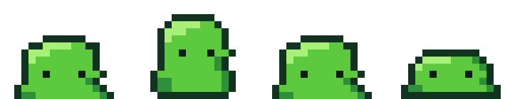

# aseprite-mcp

An [MCP](https://modelcontextprotocol.io) server that lets an AI agent **actually draw pixel art and frame-by-frame animation in Aseprite** — not just export it. Create canvases, build up layers, paint pixel by pixel, arrange frames and animation tags, manage palettes, and export GIFs or sprite sheets.

It drives Aseprite through its official `--script` headless batch interface, and every operation lands on a real `.aseprite` file — so you can open the agent's work in Aseprite and keep editing by hand at any moment.

**Zero dependencies**: no `npm install`, just Node's standard library plus one Lua script.

<p align="center">
  
  <br>
  <em>An 18×14 green slime with a squash-and-stretch idle loop — generated by <code>test/slime.js</code> through the MCP tools.</em>
</p>

---

## Requirements

- **Aseprite** 1.3+ (developed and fully verified against 1.3.18.3)
- **Node.js** 18+
- No npm packages

## Install

Clone the repository and point your MCP client at `src/server.js`:

```bash
git clone https://github.com/baichuan4167-lang/aseprite-mcp.git
node aseprite-mcp/src/server.js
```

The server looks for `aseprite.exe` in the usual install locations. If yours lives somewhere else, set `ASEPRITE_PATH` (see below).

### Wiring it into an MCP client

The server speaks MCP over stdio. Add an entry to your client's MCP configuration:

```json
{
  "mcpServers": [
    {
      "name": "aseprite",
      "command": "C:\\Program Files\\nodejs\\node.exe",
      "args": ["<absolute path to aseprite-mcp>\\src\\server.js"],
      "env": [
        { "name": "ASEPRITE_PATH", "value": "C:\\Program Files\\Aseprite\\aseprite.exe" },
        { "name": "ASEPRITE_MCP_WORKSPACE", "value": "<your project folder>" }
      ]
    }
  ]
}
```

> `command` must be an **absolute path**. On Windows, point it straight at `node.exe` to avoid `npx` / `.cmd` path trouble. On macOS the executable is `Aseprite.app/Contents/MacOS/aseprite`.

### Environment variables

| Variable | Default | Purpose |
| --- | --- | --- |
| `ASEPRITE_PATH` | auto-detected | Full path to the Aseprite executable |
| `ASEPRITE_MCP_WORKSPACE` | session cwd | Workspace root |
| `ASEPRITE_MCP_ART_ROOT` | `<workspace>/art` | Where `.aseprite` documents live |
| `ASEPRITE_MCP_EXPORT_ROOT` | `<workspace>/out` | Where exports land by default |
| `ASEPRITE_MCP_TIMEOUT_MS` | `120000` | Per-invocation timeout |

---

## Quick start

```
1. aseprite_create_sprite  document="hero" width=16 height=16
2. aseprite_pixels         rows=["..kk..", ".kssk."] key={k:"#1a1c2c", s:"#ffcd75"} x=4 y=4
3. aseprite_view           includeAscii=true        <- actually LOOK before refining
4. aseprite_add_frames     count=3 durationMs=100
5. aseprite_set_tag        name="idle" from=0 to=3
6. aseprite_export_gif     output="hero.gif" scale=6
```

Coordinates are **0-based with the origin at the top-left**; x grows right, y grows down.

---

## How it works

```
agent ──MCP/stdio──▶ server.js ──writes a command JSON──▶ aseprite.exe -b --script aseprite_lib.lua
                         ▲                                              │
                         └────────── reads a result JSON ◀──────────────┘
```

Each tool call starts one headless Aseprite process, runs `src/lua/aseprite_lib.lua`, and reads the result back from a file.

**The `.aseprite` file on disk is the single source of truth.** That keeps calls independent and order-insensitive, and it means you can open the file in Aseprite and watch the agent work.

Concurrent calls that target the same document are serialised so they cannot clobber each other.

---

## The 43 tools

### Documents

| Tool | Purpose |
| --- | --- |
| `aseprite_create_sprite` | New canvas: size, colour mode (rgb / indexed / grayscale), initial frames, layer name, palette |
| `aseprite_open` | Point the server at an existing `.aseprite` file and make it active |
| `aseprite_info` | Canvas size, colour mode, layers, per-frame durations, animation tags |
| `aseprite_status` | Aseprite location, workspace folders, documents already present |

### Layers

| Tool | Purpose |
| --- | --- |
| `aseprite_add_layer` | Add a layer, optionally placed with `below` / `above` |
| `aseprite_set_layer` | Rename, opacity, visibility, blend mode |
| `aseprite_remove_layer` | Delete a layer |
| `aseprite_merge_layer_down` | Merge downward (composited by hand, no Aseprite command needed) |

### Frames and animation

| Tool | Purpose |
| --- | --- |
| `aseprite_add_frames` | Insert empty frames (`before` / `after` / `end`) |
| `aseprite_remove_frame` | Delete a frame |
| `aseprite_duplicate_frame` | Copy a frame into the next slot — the usual starting point for animation |
| `aseprite_move_frame` | Reorder the timeline |
| `aseprite_set_frame_duration` | Frame duration in ms, optionally for a range only |
| `aseprite_copy_cel` | Copy one layer's artwork from one frame to another |
| `aseprite_set_tag` | Create/update an animation tag (`walk`), with direction and looping |
| `aseprite_remove_tag` | Delete a tag |
| `aseprite_set_loop` | Set the loop range |

### Drawing

| Tool | Purpose |
| --- | --- |
| `aseprite_pixels` | **The workhorse.** A rectangular block of pixels, given either as `pixels` (2-D array of hex colours) or as `rows` + `key` (compact character grid) |
| `aseprite_fill_regions` | Scattered individual pixels, each with its own colour |
| `aseprite_frames_from_grids` | **Draw a whole animation in one call**: one character grid per frame |
| `aseprite_draw` | Primitives: lines, rectangles, ellipses, polygons, splines, flood fill, gradients, dithering, patterns, text |
| `aseprite_draw_across_frames` | The same primitives on several frames, with a per-frame offset — the cheapest way to animate motion |
| `aseprite_text` | Built-in 5×7 pixel font |
| `aseprite_erase` | Clear a rectangle to transparent |

`aseprite_draw` accepts these `op` values:

```
{op:"pixel",   x, y, color}
{op:"line",    x1, y1, x2, y2, color}
{op:"rect",    x, y, w, h, color, filled}
{op:"ellipse", cx, cy, rx, ry, color, filled}
{op:"polygon", points:[[x,y],...], color, filled}
{op:"spline",  points:[[x,y],...], color}      smooth Catmull-Rom curve
{op:"fill",    x, y, color, tolerance}
{op:"clear",   x, y, w, h}
{op:"gradient",x, y, w, h, from, to, bands, direction}
{op:"dither",  x, y, w, h, colors:[a,b], matrix:"bayer2|bayer4|bayer8", ratio}
{op:"pattern", x, y, w, h, tile:[[...],[...]]}
{op:"text",    text, x, y, color, scale}
```

### Palette

| Tool | Purpose |
| --- | --- |
| `aseprite_set_palette` | Set an explicit colour list |
| `aseprite_load_palette` | Built-in retro palettes — `pico8` `gameboy` `nes` `db16` `db32` `sweetie16` `endesga32` — or a `.gpl` / `.ase` file |
| `aseprite_get_palette` | Read the current palette |
| `aseprite_quantize_palette` | Reduce the artwork to N colours (exact, not approximated, when the piece already uses ≤ N) |

> Several of these palettes are the work of other people and do not carry an
> explicit open-source licence. They are included because they are the standard
> palettes of the pixel-art community and ship with Aseprite itself, but if you
> plan to use them commercially, check the terms with the original author.
> See [THIRD-PARTY-NOTICES.md](THIRD-PARTY-NOTICES.md) for credits.

### Canvas and transforms

| Tool | Purpose |
| --- | --- |
| `aseprite_resize_canvas` | Resize the canvas without scaling artwork, with 9 anchor positions |
| `aseprite_crop` | Crop every frame |
| `aseprite_scale_sprite` | Integer upscale |
| `aseprite_transform` | Flip horizontally/vertically, rotate 90/180/270, add a 1 px outline |
| `aseprite_replace_color` | Replace one colour everywhere, with optional tolerance |
| `aseprite_flatten` | Merge all visible layers |

### Looking at the result

| Tool | Purpose |
| --- | --- |
| `aseprite_view` | **Renders the frame to a PNG** and returns it, optionally with an exact character pixel map |
| `aseprite_onion_preview` | Previous frame ghosted red, next frame ghosted cyan — checks that motion reads |
| `aseprite_pick_color` | Read the final composited colour at one pixel |
| `aseprite_inspect_pixels` | Dump a frame as a character grid plus palette legend (pure text, cheapest option) |

> An agent cannot see the artwork unless you hand it over. `aseprite_view` and `aseprite_onion_preview` are its eyes — **always look after drawing**.

### Import and export

| Tool | Purpose |
| --- | --- |
| `aseprite_export_png` | Single frame to PNG, optionally integer-scaled |
| `aseprite_export_gif` | Animated GIF, using each frame's own duration |
| `aseprite_export_sequence` | One PNG per frame |
| `aseprite_export_sprite_sheet` | Sprite sheet PNG **plus JSON metadata** (frame rects, durations, tags, layers) — game-engine ready |
| `aseprite_import_image` | Bring in an external image: as a new document (tracing reference) or stamped onto a layer |

---

## Suggested agent workflow

1. **Pick a small canvas.** 16–32 px for characters and items, 64–128 px for scenes. Pixel art reads best small.
2. **Use layers.** Outline, base colour, shading and highlights separately, so you can revise one without disturbing the others.
3. **Use the compact formats.** `aseprite_pixels` with `rows` + `key` costs far fewer tokens than `pixels`.
4. **Look.** Call `aseprite_view` after drawing instead of continuing on faith.
5. **Animate.** `aseprite_duplicate_frame`, then change only what moves with `aseprite_draw_across_frames`; verify with `aseprite_onion_preview`.
6. **Export.** Sprite sheet + JSON for engines, GIF for previews.

---

## Tests

No Aseprite required — CI runs these on every push:

```bash
node test/syntax-check.js   # every JS file parses, no UTF-8 BOM anywhere, Lua compiles
node test/protocol.js       # MCP handshake and the full tool catalog, without Aseprite
```

Requires a real Aseprite installation:

```bash
node test/smoke.js          # 85 end-to-end assertions across every tool
node test/slime.js          # draws a green slime idle loop and exports it
node test/demo-art.js       # draws a 4-frame walk cycle and exports it
```

`smoke.js` spawns the server over the real stdio protocol and checks each tool's
behaviour and its output files — including decoding the exported PNGs and
measuring the ink, because dimension-only checks once let a real scaling bug
through. The two demo scripts write `art/*.aseprite` and the GIF / sprite sheet /
frame sequence into `out/`.

Focused probes for the behaviours that caused the most trouble:

| Script | Purpose |
| --- | --- |
| `test/probe-sheet-verify.js` | Decodes a sprite sheet and measures each frame's ink (catches scaling bugs) |
| `test/probe-canvas.js` | Canvas resize and crop |
| `test/probe-view.js` | Preview scaling |
| `test/probe-grids.js` | Character-grid multi-frame drawing |
| `test/probe-quantize.js` | Palette quantization |

`test/harness.js` is a small MCP client over stdio, and `test/png.js` a
dependency-free PNG decoder, both used by the suites above.

---

## Implementation notes

This Aseprite build's Lua API differs from the published documentation in several important ways. `src/lua/aseprite_lib.lua` works around them, and each workaround is documented at the call site. The highlights:

- **`json.decode` returns userdata, not a table**, so `type(x) == "table"` fails → everything goes through an `istable()` predicate.
- **`Image:drawImage(src, Rectangle(...), x, y)` clears the destination**; only the `drawImage(src, x, y)` form is reliable → all copies go through `blit()`.
- **`Sprite:newFrame(n)` takes a *duration in seconds*, not an index**, and `reorderFrame` / `DuplicateFrame` / `Crop` / `MergeDown` do not exist → inserting, duplicating and reordering frames rebuilds the timeline in the required order.
- **`app.command.CanvasSize` does not actually resize** and `Sprite:resize` scales but destroys cel contents → canvas operations rebuild the cels instead.
- **Layer order comes from the writable `Layer.stackIndex`** (the value is the final position); there is no `reorderLayer`.
- **In indexed mode `getPixel` returns a palette index**, not an RGBA word → colour access goes through mode-aware helpers.
- **Floats are fatal**: JSON numbers decode as floats but Aseprite's Lua bindings demand integers, so every coordinate passes through `int()`.
- **Aseprite's Lua has no bitwise operators**, so base64 and bit twiddling are hand-written.
- **No UTF-8 BOM**: a `.lua` file with a BOM is an immediate syntax error.

Because `DrawText` is unavailable in batch mode, the server ships its own 5×7 bitmap font (the `FONT` table) that you can read and edit directly.

## License

MIT
